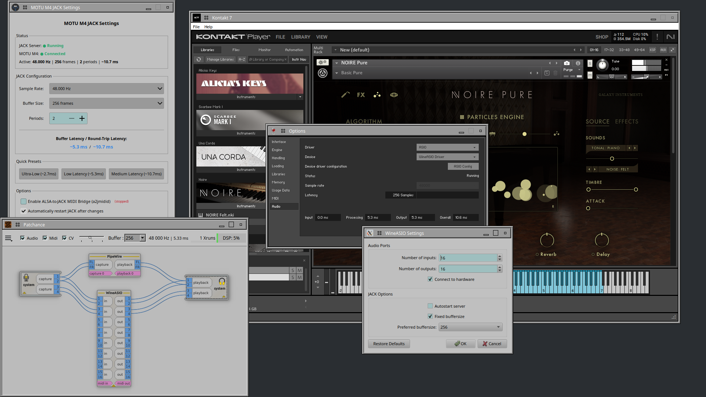

# WineASIO

WineASIO provides an ASIO to JACK driver for WINE, enabling professional Windows audio applications to run seamlessly on Linux with low-latency performance.

ASIO (Audio Stream Input/Output) is the industry-standard Windows low-latency audio driver, commonly used by DAWs, virtual instruments, and audio production software. WineASIO bridges ASIO calls to JACK, allowing you to integrate Windows applications into a native Linux audio workflow with PipeWire/JACK.

**Compatible Applications:** FL Studio, Native Instruments Kontakt, EZkeys, UVI Workstation, Reaper, and many other professional audio programs.

### Professional Audio Production Setup

The screenshot below demonstrates a complete Linux audio production environment with WineASIO seamlessly integrating Windows software into the native JACK/PipeWire audio infrastructure:

- **MOTU M4 JACK Settings** (left) - Running with optimized low-latency configuration (~10.7ms at 48kHz, 256 frames, 2 periods)
- **Patchance** (bottom-left) - Visualizing real-time audio routing between WineASIO, PipeWire, and hardware interfaces
- **Native Instruments Kontakt 7** (right) - Professional sample library running flawlessly with excellent sound quality via WineASIO

This setup proves that Linux is a fully viable platform for professional audio production, combining the power of open-source tools with industry-standard Windows audio software.

<p align="center">
  
</p>

*Complete audio production setup: MOTU M4 JACK Settings, Patchance showing WineASIO routing, and Native Instruments Kontakt 7 running via Wine 11*

---

## 🎉 Wine 11 Support (v1.4.2)

**WineASIO now fully supports Wine 11, including 32-bit applications!**

Wine 11 (released January 13, 2026) introduced a new DLL architecture that separates PE (Windows) code from Unix code. This required a complete rewrite of WineASIO's build system and internal architecture.

### ⚠️ Important: Wine 11 WoW64 Architecture

In Wine 11 WoW64, **32-bit PE DLLs use 64-bit Unix libraries**. This is different from traditional Wine where 32-bit used 32-bit Unix libraries.

```
32-bit PE (wineasio.dll) → WoW64 Thunking → 64-bit Unix (wineasio.so)
```

This means:
- `wineasio.dll` (32-bit PE) is installed to `i386-windows/`
- `wineasio.so` (64-bit Unix!) is installed to `x86_64-unix/` (NOT `i386-unix/`)

### Wine Version Compatibility

| Wine Version | Build Method | Status |
|--------------|--------------|--------|
| Wine 11.x | `make -f Makefile.wine11` | ✅ Fully Supported |
| Wine 10.2+ | `make -f Makefile.wine11` | ✅ Fully Supported |
| Wine 10.0-10.1 | `make` (legacy) | ✅ Supported |
| Wine 6.x-9.x | `make` (legacy) | ✅ Supported |

---

## Building for Wine 11+

### Prerequisites

```sh
# Ubuntu/Debian
sudo apt install gcc-mingw-w64 wine-stable wine-stable-dev libjack-jackd2-dev

# Fedora
sudo dnf install mingw64-gcc mingw32-gcc wine-devel jack-audio-connection-kit-devel

# Arch Linux
sudo pacman -S mingw-w64-gcc wine wine-staging jack2
```

### Build Commands (Wine 11+)

Build both 32-bit and 64-bit versions:

```sh
make -f Makefile.wine11 all
```

Build only 64-bit:

```sh
make -f Makefile.wine11 64
```

Build only 32-bit:

```sh
make -f Makefile.wine11 32
```

### Installation (Wine 11+)

```sh
sudo make -f Makefile.wine11 install
```

This will:
- Copy `wineasio64.dll` to Wine's 64-bit PE directory
- Copy `wineasio64.so` to Wine's 64-bit Unix directory  
- Copy `wineasio.dll` to Wine's 32-bit PE directory
- Copy `wineasio.so` to Wine's 32-bit Unix directory
- Register the driver with Wine

### Manual Installation (Wine 11+)

For custom Wine installations, specify the Wine prefix:

```sh
sudo make -f Makefile.wine11 install WINE_PREFIX=/path/to/wine
```

Default paths for Wine 11:

```sh
# 64-bit
sudo cp build_wine11/wineasio64.dll /opt/wine-stable/lib/wine/x86_64-windows/
sudo cp build_wine11/wineasio64.so /opt/wine-stable/lib/wine/x86_64-unix/

# 32-bit (note: Unix .so goes to x86_64-unix, NOT i386-unix!)
sudo cp build_wine11/wineasio.dll /opt/wine-stable/lib/wine/i386-windows/
sudo cp build_wine11/wineasio.so /opt/wine-stable/lib/wine/x86_64-unix/
```

**Note:** In Wine 11 WoW64, there is NO `i386-unix/` directory. All Unix libraries are 64-bit.

### Registration (Wine 11+)

After installation, register the driver:

```sh
# 64-bit
wine regsvr32 wineasio64.dll

# 32-bit (use syswow64 regsvr32 for WoW64)
wine ~/.wine/drive_c/windows/syswow64/regsvr32.exe wineasio.dll
```

Or use the Makefile:

```sh
make -f Makefile.wine11 register
```

### Verify Installation

```sh
make -f Makefile.wine11 verify
```

This checks:
- All DLL and SO files are in place
- Registry entries are correct

---

## Building for Wine 10.1 and Earlier (Legacy)

### Build Commands

```sh
# 32-bit
make 32

# 64-bit
make 64
```

### Installation (Legacy)

```sh
# 32-bit
sudo cp build32/wineasio32.dll /usr/lib/i386-linux-gnu/wine/i386-windows/
sudo cp build32/wineasio32.dll.so /usr/lib/i386-linux-gnu/wine/i386-unix/

# 64-bit
sudo cp build64/wineasio64.dll /usr/lib/x86_64-linux-gnu/wine/x86_64-windows/
sudo cp build64/wineasio64.dll.so /usr/lib/x86_64-linux-gnu/wine/x86_64-unix/
```

**Note:** Wine paths vary between distributions. Adjust paths accordingly.

---

## Registering WineASIO

After installing, register WineASIO in your Wine prefix:

```sh
wineasio-register
```

### Custom Wine Prefix

```sh
env WINEPREFIX=~/my-daw-prefix wineasio-register
```

---

## Configuration

WineASIO is configured via the Windows registry (`HKEY_CURRENT_USER\Software\Wine\WineASIO`).  
All options can be overridden by environment variables.

### Available Options

| Registry Key | Default | Environment Variable | Description |
|--------------|---------|---------------------|-------------|
| Number of inputs | 16 | `WINEASIO_NUMBER_INPUTS` | Number of JACK input ports |
| Number of outputs | 16 | `WINEASIO_NUMBER_OUTPUTS` | Number of JACK output ports |
| Autostart server | 0 (off) | `WINEASIO_AUTOSTART_SERVER` | Start JACK automatically |
| Connect to hardware | 1 (on) | `WINEASIO_CONNECT_TO_HARDWARE` | Auto-connect to physical ports |
| Fixed buffersize | 1 (on) | `WINEASIO_FIXED_BUFFERSIZE` | Buffer size controlled by JACK |
| Preferred buffersize | 1024 | `WINEASIO_PREFERRED_BUFFERSIZE` | Preferred buffer size (power of 2) |
| Client name | (auto) | `WINEASIO_CLIENT_NAME` | JACK client name |

### GUI Control Panel (Wine 11)

A PyQt5/PyQt6 control panel is included for configuring WineASIO settings. When you click "Show ASIO Panel" in your DAW (e.g., FL Studio, Reaper), WineASIO launches the native Linux settings GUI.

**How it works:**
1. Your DAW calls the ASIO `ControlPanel()` function
2. WineASIO's Unix-side code uses `fork()/exec()` to launch `wineasio-settings`
3. The Python/PyQt GUI reads and writes settings to the Wine registry

**Launch manually:**

```sh
# From Linux terminal
wineasio-settings

# From Wine (using Windows launcher)
wine /usr/share/wineasio/wineasio-settings64.exe
```

**Requirements:**
- PyQt5 or PyQt6: `pip install PyQt5` or `pip install PyQt6`

---

## MIDI Support

WineASIO handles **audio only** (ASIO). For MIDI with Windows applications under Wine, use Wine's built-in MIDI support:

### How Wine MIDI Works

Wine's `winealsa.drv` provides Windows MIDI API support via ALSA MIDI. To use MIDI devices with JACK:

```sh
# Start the ALSA-to-JACK MIDI bridge
a2jmidid -e &

# List available MIDI ports
jack_lsp | grep -i midi
```

You should see your MIDI devices as `a2j:` ports:
```
a2j:Kurzweil KM88 [16] (capture): [0] Kurzweil KM88 (USB MIDI)
a2j:Kurzweil KM88 [16] (playback): [0] Kurzweil KM88 (USB MIDI)
a2j:WINE midi driver [129] (playback): [0] WINE ALSA Input
```

### Connecting MIDI Devices to Wine Applications

Use `jack_connect`, QjackCtl, or Carla to route MIDI from your hardware to Wine:

```sh
# Connect a hardware MIDI keyboard to Wine
jack_connect "a2j:Your Keyboard (capture)" "a2j:WINE midi driver (playback)"
```

The MIDI devices will then appear in your Windows DAW's MIDI settings.

---

## Troubleshooting

### Settings GUI doesn't open

1. Ensure `wineasio-settings` is in PATH: `which wineasio-settings`
2. Check PyQt is installed: `python3 -c "from PyQt5.QtWidgets import QApplication"`
3. Try launching manually: `wineasio-settings`

### Wine 11: "Unix library not found"

Ensure both PE and Unix libraries are installed:

```sh
# Check files exist
ls -la /opt/wine-stable/lib/wine/x86_64-windows/wineasio64.dll
ls -la /opt/wine-stable/lib/wine/x86_64-unix/wineasio64.so
```

### Wine 11: DLL not loading

Make sure the DLL is marked as a Wine builtin:

```sh
sudo winebuild --builtin /opt/wine-stable/lib/wine/x86_64-windows/wineasio64.dll
```

### JACK not connecting

1. Ensure JACK is running: `jack_lsp`
2. Check WineASIO JACK client: `jack_lsp | grep -i wine`
3. Use QjackCtl or Carla to manage connections

### 32-bit apps not finding WineASIO

32-bit Windows apps use WoW64. Ensure:
- `wineasio.dll` is in `i386-windows/`
- `wineasio.so` is in `x86_64-unix/` (NOT `i386-unix/` - Wine 11 WoW64 uses 64-bit Unix libs!)
- Register with 32-bit regsvr32: `wine regsvr32 wineasio.dll`

### No audio from 32-bit apps (Wine 11)

If 32-bit apps load WineASIO but produce no audio:
1. Verify `wineasio.so` is 64-bit: `file /path/to/wine/x86_64-unix/wineasio.so` should say "ELF 64-bit"
2. Check for `[WineASIO-Unix]` debug messages - if missing, Unix library not loading
3. Rebuild with `make -f Makefile.wine11 32` and reinstall


---

## Technical Details (Wine 11 Architecture)

Wine 11 requires a split architecture:

| Component | Description | Built With | Install Location |
|-----------|-------------|------------|------------------|
| `wineasio64.dll` | 64-bit PE DLL (Windows code) | mingw-w64 `-m64` | `x86_64-windows/` |
| `wineasio64.so` | 64-bit Unix library (JACK interface) | gcc `-m64` | `x86_64-unix/` |
| `wineasio.dll` | 32-bit PE DLL (Windows code) | mingw-w64 `-m32` | `i386-windows/` |
| `wineasio.so` | **64-bit** Unix library for 32-bit PE | gcc **`-m64`** | **`x86_64-unix/`** |

**Critical:** In Wine 11 WoW64, the Unix library for 32-bit PE is 64-bit, not 32-bit!

The PE DLL handles:
- COM/ASIO interface
- Registry configuration
- Host application callbacks

The Unix SO handles:
- JACK connection and audio processing
- Real-time audio callbacks
- Buffer management

Communication between PE and Unix uses Wine's `__wine_unix_call` interface.

---

## File Structure

```
wineasio/
├── asio_pe.c           # PE-side code (Wine 11)
├── asio_unix.c         # Unix-side code (Wine 11)
├── unixlib.h           # Shared interface definitions
├── Makefile.wine11     # Wine 11+ build system
├── Makefile            # Legacy build system
├── asio.c              # Legacy combined code
├── wineasio.def        # Export definitions
├── gui/                # PyQt control panel
│   ├── settings.py     # Main settings GUI
│   └── ui_settings.py  # UI definitions
├── docs/               # Documentation
│   ├── DEVELOPMENT.md              # Developer guide
│   ├── WINE11_PORTING.md           # Wine 11 porting details
│   ├── WINE11_WOW64_ARCHITECTURE.md
│   └── WINE11_WOW64_32BIT_SOLUTION.md
├── tests/              # Test programs
│   └── test_asio_*.c
└── docker/             # Docker build environment
```

---

## Change Log

See [CHANGELOG.md](https://github.com/giang17/wineasio/blob/master/CHANGELOG.md) for the full changelog.

---

## Contributing

Contributions are welcome! Please test with:
- Wine 11.x (new architecture)
- Various DAWs (FL Studio, Reaper, Ableton, Bitwig, etc.)
- Both 32-bit and 64-bit applications

---

## Legal

Copyright (C) 2006 Robert Reif  
Portions copyright (C) 2007 Ralf Beck  
Portions copyright (C) 2007 Johnny Petrantoni  
Portions copyright (C) 2007 Stephane Letz  
Portions copyright (C) 2008 William Steidtmann  
Portions copyright (C) 2010 Peter L Jones  
Portions copyright (C) 2010 Torben Hohn  
Portions copyright (C) 2010 Nedko Arnaudov  
Portions copyright (C) 2011 Christian Schoenebeck  
Portions copyright (C) 2013 Joakim Hernberg  
Portions copyright (C) 2020-2023 Filipe Coelho  
Portions copyright (C) 2026 Wine 11 Port Contributors

The WineASIO library code is licensed under LGPL v2.1, see COPYING.LIB for more details.
The WineASIO settings UI code is licensed under GPL v2+, see COPYING.GUI for more details.

### ASIO SDK Note

WineASIO does **not** require the Steinberg ASIO SDK to build. All ASIO interface definitions (structures, constants, enums) are implemented independently in this project. This is legally permissible as APIs and interfaces are not copyrightable.

Older documentation (e.g., wiki pages from 2011) may mention downloading `asio.h` from Steinberg - this is no longer necessary. Additionally, Steinberg has since released the ASIO SDK under GPLv3 (the "Open Source" variant), making it compatible with open source projects.

ASIO is a trademark of Steinberg Media Technologies GmbH.
